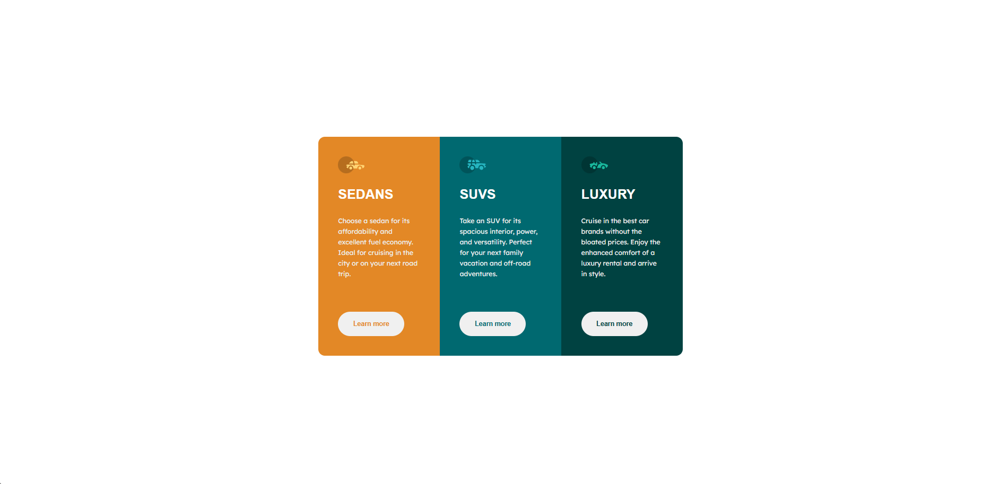
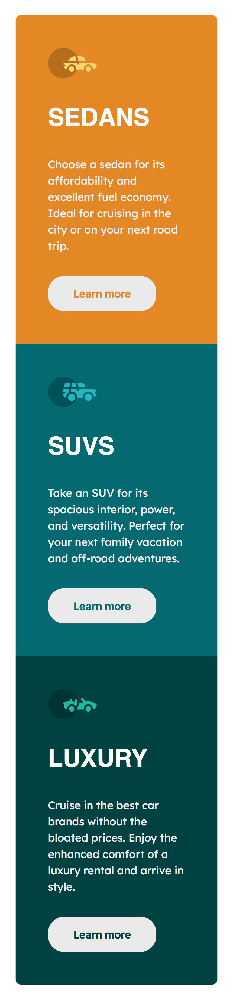

3-Column Product Preview Card Component 🌸

A modern, responsive 3-column card layout built with HTML and CSS. This component showcases three types of vehicles with clean design, highlighting key information, icons, and call-to-action buttons.

About 📝

This project is a responsive 3-column card UI component inspired by modern web design and e-commerce layouts. It demonstrates layout skills using Flexbox, clean typography, and responsive styling for mobile and desktop.

Perfect for portfolios or as a reusable component for service/product cards.

Demo 🎬

Live demo: 
[View Demo](https://anile7.github.io/3-column-preview-card/)

Screenshot: 

Desktop view

Mobile view

Features ✨
- Responsive design for desktop and mobile
- Clean and minimal UI/UX
- Distinctive color themes for each card - visually appealing
- Interactive hover effects on buttons - highlights interactivity

Technologies 🛠️
- HTML5
- CSS3 (Flexbox, Media Queries)
- Google Fonts

Acknowledgements 🙏
- This design is inspired by a challenge from [Frontend Mentor.](https://www.frontendmentor.io/)
